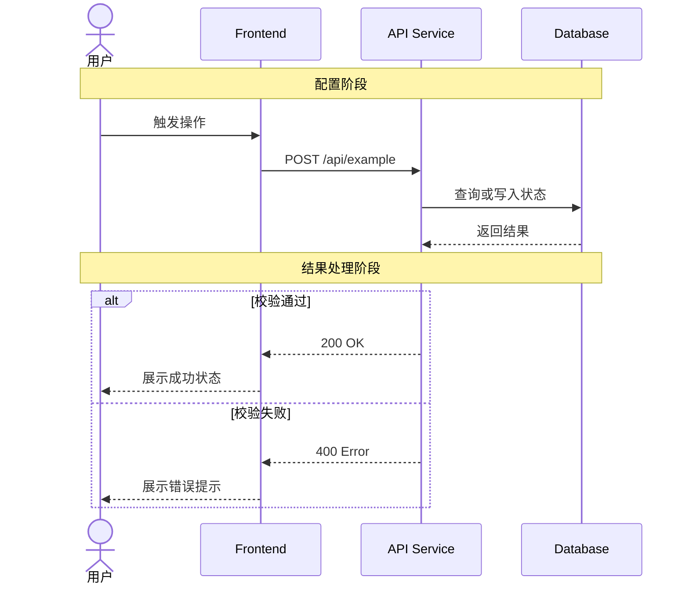

# 设计文档规范

## 文件位置

- 当前：`docs/dev/sdd/design.md`
- 归档：`docs/archive/YYYYMMDD-<主题名>/sdd/design.md`

## 通用可读性要求

设计文档是实现、评审和后续维护的事实源，必须让读者能快速看懂“为什么改、从哪里进、改哪里、如何验证”：

- 先给设计目标和非目标，再进入调用链和修改点。
- 调用链用编号步骤、ASCII 图或 Mermaid 表达，不能只列文件名。
- 规则、策略、兼容性、文件清单和 TC 映射优先用表格表达。
- Before/After 代码块只保留关键差异，不贴大段实现。
- 每个新增接口、状态、策略名都要说明事实源位置、兼容性和验证方式。
- 长段解释超过 5 行时拆成小节、表格或图。
- 不内嵌大段 HTML；可视化优先使用 Markdown 表格、Mermaid、引用块和代码块。

## 推荐阅读结构

设计文档应接近“技术评审页”的阅读体验。推荐结构：

| 阅读区块 | Markdown 表达 | 目的 |
|----------|---------------|------|
| 首屏摘要 | 标题 + 文档信息表 + 2-3 句话摘要 | 先说明设计目标、状态和读者入口 |
| 目标 / 非目标 | 双列表表格 | 快速对比做什么、不做什么 |
| 当前调用链 | 步骤表、ASCII 图或 Mermaid | 对应 HTML 里的流程步骤条 |
| 目标架构 | 原则表、策略表、接口草图 | 对应架构卡片和决策表 |
| 修改方案 | 文件级小节 + Before/After | 快速定位改哪里 |
| 数据与兼容性 | 矩阵表 | 快速判断是否要迁移或兼容旧数据 |
| 调用链 After | Mermaid 或步骤表 | 验证新链路是否闭环 |
| 验证设计 | TC 映射表 | 让任务拆解和 review 可追踪 |
| 风险与治理 | 风险矩阵 | 暴露剩余风险和缓解方式 |

## 文档结构

```markdown
# 技术设计文档 — {标题}

## 文档信息
| 属性 | 值 |
|------|----|
| 文档类型 | Design |
| 最后更新 | YYYY-MM-DD |
| 当前状态 | Draft / Review / Confirmed |
| 关联需求 | `requirements.md` |
| 关联调研 | `docs/dev/research/{主题}.md`（如有） |

## 摘要
[2-3 句话说明为什么这么设计、核心边界、主要改动面]

## UI 设计稿索引（如有）
| 设计稿 | 路径 | 说明 |

## 一、已完成设计（摘要）
[已交付 Phase 的设计，一段话概括]

## 二、当前设计
### 2.1 设计理念
| 目标 | 非目标 |
|------|--------|
| {本次设计要达成的能力} | {明确不做的能力} |

### 2.2 现有基础设施
| 模块 | 位置 | 当前状态 | 备注 |
|------|------|----------|------|

### 2.3 调用链分析（必须，需用户确认）
[从入口到落地的完整调用链路图，标注每个环节的文件路径、函数名、当前状态]

| 步骤 | 组件/模块 | 文件/函数 | 当前状态 | 说明 |
|------|-----------|-----------|----------|------|

#### 序列图（按需，内嵌）
[跨组件交互、API / 鉴权、异步消息或复杂状态流转时，在本节直接内嵌 Mermaid 或 PlantUML 序列图]

### 2.4 修改方案
[基于调用链分析，列出每个修改点的具体代码变更]

### 2.5 数据与兼容性
| 对象 | 设计 | 兼容性 |

## 三、涉及文件清单
| 文件路径 | 改动 | 关联 US | 验证 |

## 四、测试设计
| TC | 覆盖点 | 建议验证 |

## 五、风险与治理
| 风险 | 影响 | 治理方式 |
```

## 编写要点

**关联调研的使用边界**：
- `docs/dev/research/{主题}.md` 适合记录背景、候选方案、风险、权衡和开放问题
- 调研结论只有在被正式写入 `design.md` 后，才能作为实现和拆任务依据
- 不要把 research 文档中的临时判断、未确认假设、聊天备注直接当成最终设计

### 调用链分析（核心，必须与用户确认）

设计文档**必须**包含实际系统的调用链或执行流程分析，不能只写抽象方案。要求：

1. **画出完整调用链路图**：从用户操作/入口到最终落地的每一层调用关系
2. **标注每个节点的状态**：哪些已有（✅）、哪些需新增（🔴）、哪些需修改（🟡）
3. **标注具体位置**：文件路径/模块名 + 入口函数/接口名 + 大致位置
4. **列出实际修改方案**：每个修改点的 before/after 代码片段、伪代码或 diff 示意

```
示例（调用链路图）：

用户入口 / 上游调用方
  │ 调用 startWorkflow(input, options)
  ▼
┌─────────────────────────────────────────────────────┐
│ [入口适配层] path/to/entry                           │
│  request = normalize(input, options)                 │
│    globalGoal: options?.globalGoal,    ✅ 已有        │
│    actorProfile: options?.actorProfile, 🔴 待开发    │
│  }                                                   │
│  new WorkflowExecutor(request)                       │
└──────────────┬──────────────────────────────────────┘
               ▼
┌─────────────────────────────────────────────────────┐
│ [核心执行器] path/to/executor                        │
│  buildExecutionContext()              🔴 需修改      │
│    当前：只用 baseContext + globalGoal                │
│    改为：+ actorProfile / capability config          │
└─────────────────────────────────────────────────────┘
```

### 序列图（按需，统一放在 design.md）

序列图是调用链分析的辅助凭证，不替代文字说明、文件路径、函数名、接口约束和状态标注。只在交互复杂度值得用图表达时使用，并且统一内嵌在 `docs/dev/sdd/design.md` 的调用链分析章节下，不新增 `docs/dev/sdd/diagrams/` 等图表目录。

建议使用序列图的场景：
- 前端 / 网关 / 服务 / 数据库 / 第三方系统之间存在多跳调用
- API、IPC、SDK、Webhook、鉴权、Token 刷新或权限校验链路
- 异步消息、事件发布、队列消费、回调或并行处理
- 关键状态流转包含成功路径和失败分支，单纯 ASCII 调用链不够清晰

可不画序列图的场景：
- 单文件、单函数或局部样式调整
- 只有一个入口和一个落点，ASCII 调用链已能清楚表达
- 图无法对应到实际文件、接口、状态或任务

格式选择：
- 默认使用 Mermaid `sequenceDiagram`，便于直接嵌入 Markdown 并随 `design.md` review。
- 用户明确要求 PlantUML，或设计文档已有 PlantUML 风格时，可用 `plantuml` fenced block，但仍直接内嵌到 `design.md`。
- Mermaid fenced block 中只能使用 Mermaid 原生语法；不要把 PlantUML 的 `== 阶段 ==` 分隔符写进 `sequenceDiagram`。
- 不生成独立 `.mmd` / `.puml` 文件，不新增图表目录。

编写要求：
1. 先识别参与者、外部 actor 和系统归属边界。
2. 先画主成功路径，再用 `alt` / `else` 补充过期、校验失败、缺少绑定、权限失败等关键分支。
3. 参与者按用户 → 前端 → 网关/API → 服务 → 数据库/外部系统的阅读顺序排列。
4. message label 保持短句，可包含接口名、事件名、Token 操作或状态变更，不写大段解释。
5. 只在跨边界、导航事件、Token 交接、异步契约等容易误解的位置加 note。
6. 如需在图内表达阶段边界，使用 `Note over <first>,<last>: 阶段说明`；如阶段说明较长，优先放到图外 Markdown 小标题。
7. 图中关键节点必须能在后续修改方案、文件清单或任务中找到对应落点。

Mermaid 示例：



**禁止**：
- ❌ 只写“修改某模块支持新能力”这种抽象描述
- ❌ 不画调用链直接列文件清单
- ❌ 不标注当前代码状态（已有/待开发/需修改）
- ❌ 为简单局部改动强行画图
- ❌ 把序列图放到额外目录或独立文件
- ❌ 序列图与文字设计、文件清单或任务拆解不一致
- ❌ 在 `mermaid` fenced block 中输出 PlantUML 风格阶段分隔符，例如 `== 配置阶段 ==`
- ❌ 依赖预览器或业务代码对无效 Mermaid 做定制兜底

**调用链分析完成后，先执行 `requirements-design-review`。** Review 无阻断问题时，才进入用户确认暂停点；Review 有阻断问题时，先停下治理并复审，不把未治理的问题交给用户确认。
用户确认后才能进入任务拆解。

### 数据模型

数据模型和关键接口要可读、可约束、可验证。若仓库使用强类型语言，字段应有注释且类型明确；若是动态语言，也要写清字段约束、默认值和校验边界。

```typescript
// 示例：若仓库使用 TypeScript
interface ExecutorConfig {
  /** 当前工作流引用到的 Agent 角色列表 */
  agents?: AgentRole[]
}

// 反例
interface ExecutorConfig {
  agents?: any[]
}
```

### 代码修改示意

标注文件路径和大致行号，给出 before/after 对比，让开发者快速定位。

建议格式：

```markdown
#### 修改点：{模块 / 文件}
| 维度 | Before | After |
|------|--------|-------|
| 行为 | {当前行为} | {目标行为} |
| 数据 | {当前数据} | {目标数据} |
| 验证 | {当前缺口} | {验证方式} |
```

**TC 编号**：
- 按功能域命名前缀：如 `TC-AUTH`、`TC-SYNC`、`TC-EXPORT`
- 分配前必须用仓库可用搜索方式确认无冲突（如 `rg "TC-{前缀}-"`）
- 已有前缀不要复用于不同功能语义

**TC 模板**：
```markdown
### TC-{前缀}-{NNN}: {标题}
前提：{输入/配置条件}
断言：{预期输出/行为}
```

**可观测标识规划**：UI 或交互变更时规划稳定的自动化标识，如 `data-testid`、可访问标签或测试选择器，格式建议 `{模块}-{元素用途}[-{动态标识}]`。

## 评审清单

- [ ] 覆盖所有关联 US
- [ ] **有完整调用链路图**（从入口到落地，标注文件/函数/状态）
- [ ] 复杂跨组件交互已有内嵌序列图，或明确说明 ASCII 调用链足够
- [ ] `requirements-design-review` 结论为 PASS 且 `Blocking: false`
- [ ] **调用链已与用户确认**（确认后才能拆任务）
- [ ] 每个修改点有 before/after 代码示意
- [ ] 数据模型字段约束明确，关键边界可验证
- [ ] 涉及文件清单完整
- [ ] TC 编号 grep 确认无冲突
- [ ] UI 变更有稳定自动化标识规划
